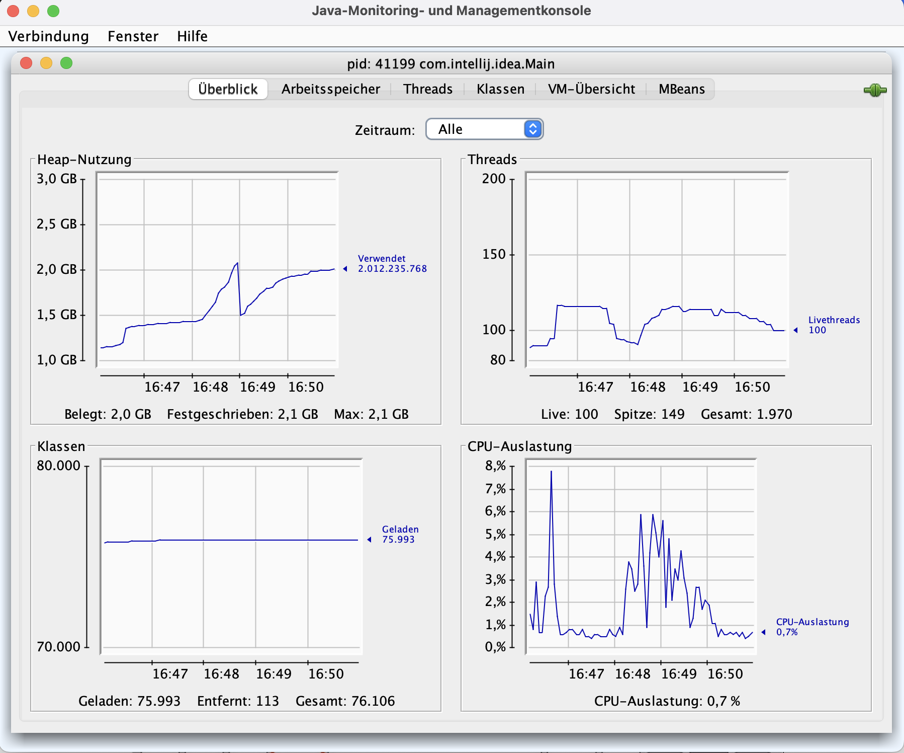

# VM Options for Compilation

### Display Compilation Levels on Console
* Level 0 --> no compilation
* Levels 1-3 --> C1 compiler
* Level 4 --> C2 compiler
* % --> Code cache

-XX:+PrintCompilation

### Log Compilation Levels in Log File
*Especially helpful for diagnostic of remote compilations*

-XX:+UnlockDiagnosticVMOptions

-XX:+LogCompilation

# VM Options to Increase Code Cache

### Display the Size of the Code Cache
-XX:+PrintCodeCache

### Increase the Size of the Code Cache
In case there is a warning like: 

> Code cache is full. Compiler has been disabled.

-XX:InitialCodeCacheSize=20m

-XX:ReservedCodeCacheSize=50m

-XX:CodeCacheExpansionSize=5m

# Java Monitoring And Management Console

`jconsole` is a GUI for JVM monitoring and management. It can be used to monitor JVM performance, memory usage, thread statistics, and other JVM information. It is a tool for developers and management.

Note: *jconsole uses about 2MB of code cache on its own!

### Switch off Code Compilation

*You could use the below-mentioned VM option to switch off code compilation entirely. But that is usually not a good choice.*

-XX:-TieredCompilation

### Display Java VM Flags in Console

`java -XX:+PrintFlagsFinal`

### Display PIDs of All Running Java Processes

`jps`   

### Display a Specific VM Flag

I.e. display the number of compiler threads ...

`jinfo -flag CICompilerCount 41096`

### Configure the Number of Compiler Threads

The number of compiler threads is configurable. The default is 2. In order to increase it you could use the following VM option.

-XX:CICompilerCount=4

### Configure the Compiler Threshold
The compiler threshold is configurable. It is used to determine when a piece of code is compiled to a higher level (1-4). The lower the threshold, the more code is compiled to a higher level. In order to configure it you could use the following VM option.

-XX:CICompilerThreshold=10192

# VM Options for String Pool Optimization

### Display the Size of the String Pool

-XX:+PrintStringTableStatistics

### Increase the Size of the String Pool

-XX:StringTableSize=100000

# VM Options for Heap Size Tuning

### Display the Size of the Heap

-XX:+UnlockDiagnosticVMOptions

-XX:+PrintFlagsFinal 
... and look for MaxHeapSize (4.294.967.296 bytes) and InitialHeapSize (268.435.456 bytes)

### Increase the Size of the Heap

-XX:MaxHeapSize=6g

-XX:InitialHeapSize=500m

... or use the shortcuts:

-Xmx6g - for maximum heap size

-Xms500m - for initial heap size

### VM Options for Generating a Heap Dump

-XX:+HeapDumpOnOutOfMemoryError

-XX:HeapDumpPath=/path/to/dumpfile

### VM Options for Monitoring Garbage Collection

-verbose:gc

### VM Options for Turning Off Automated Heap Allocation Sizing

-XX:-UseAdaptiveSizePolicy

### VM Options for Tuning the Garbage Collection

-XX:SurvivorRatio=8 to determine the ratio of S0/S1 to young generation. The default is 8 (S0/S1 is each 1/8 of young generation).

-XX:NewRatio=2 to determine the ratio of new generation to old generation. The default is 2 (old generation is twice as large as new generation).

-XX:MaxTenuringThreshold=15 to determine the maximum age of an object before it is promoted to old generation. The default is 15.

**But actually, the G1 garbage collector which used by default does usually not need any tuning.**

### VM Options for String De-duplication on G1 Garbage Collector

-XX:+UseStringDeduplication

-XX:+UseStringDeduplication